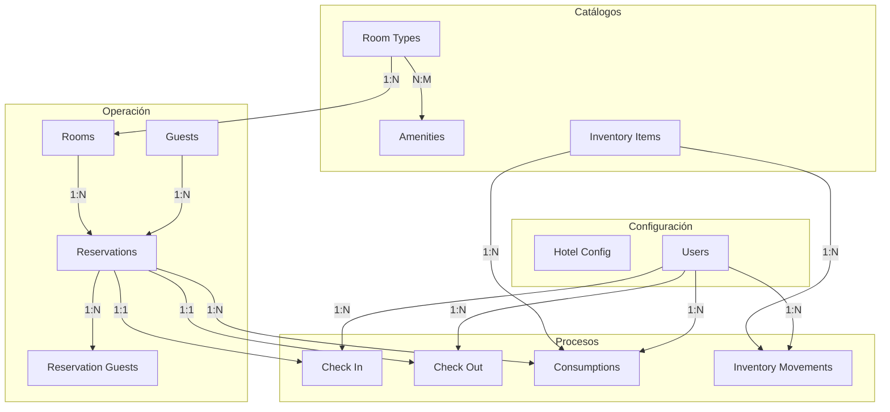
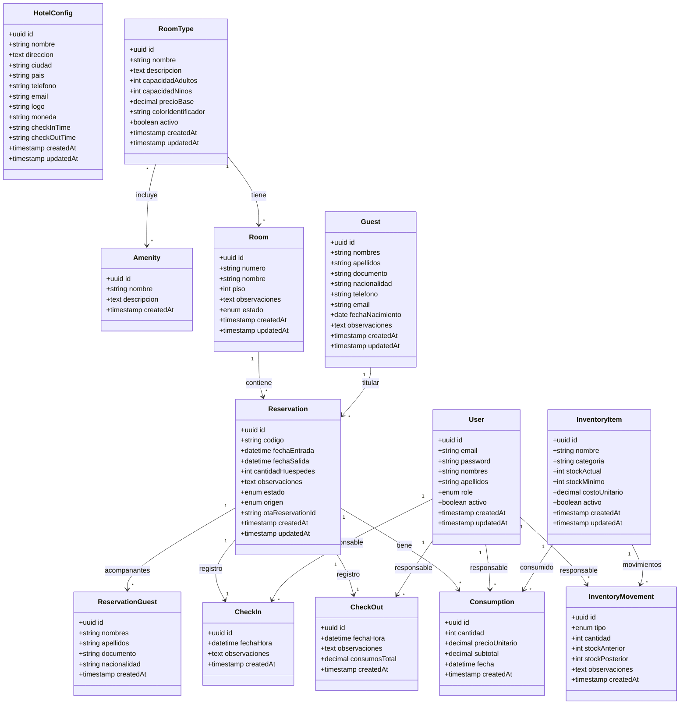

# PMS Hotel - Modelo Entidad Relación (ERD)

## 1. Diagrama de Entidades

```mermaid
erDiagram
    USERS {
        uuid id PK
        varchar email UK
        varchar password
        varchar nombres
        varchar apellidos
        enum role "admin | reception"
        boolean activo
        timestamp created_at
        timestamp updated_at
    }

    HOTEL_CONFIG {
        uuid id PK
        varchar nombre
        text direccion
        varchar ciudad
        varchar pais
        varchar telefono
        varchar email
        varchar logo
        varchar moneda
        varchar check_in_time
        varchar check_out_time
        timestamp created_at
        timestamp updated_at
    }

    ROOM_TYPES {
        uuid id PK
        varchar nombre UK
        text descripcion
        int capacidad_adultos
        int capacidad_ninos
        decimal precio_base
        varchar color_identificador
        boolean activo
        timestamp created_at
        timestamp updated_at
    }

    AMENITIES {
        uuid id PK
        varchar nombre UK
        text descripcion
        timestamp created_at
    }

    ROOM_TYPE_AMENITIES {
        uuid room_type_id FK
        uuid amenity_id FK
    }

    ROOMS {
        uuid id PK
        varchar numero UK
        varchar nombre
        uuid room_type_id FK
        int piso
        text observaciones
        enum estado "disponible | reservada | ocupada | limpieza | mantenimiento"
        timestamp created_at
        timestamp updated_at
    }

    GUESTS {
        uuid id PK
        varchar nombres
        varchar apellidos
        varchar documento UK
        varchar nacionalidad
        varchar telefono
        varchar email
        date fecha_nacimiento
        text observaciones
        timestamp created_at
        timestamp updated_at
    }

    RESERVATIONS {
        uuid id PK
        varchar codigo UK
        uuid room_id FK
        uuid guest_id FK
        datetime fecha_entrada
        datetime fecha_salida
        int cantidad_huespedes
        text observaciones
        enum estado "pendiente | confirmada | checkin | checkout | cancelada"
        enum origen "directo | booking | airbnb"
        varchar ota_reservation_id
        timestamp created_at
        timestamp updated_at
    }

    RESERVATION_GUESTS {
        uuid id PK
        uuid reservation_id FK
        varchar nombres
        varchar apellidos
        varchar documento
        varchar nacionalidad
        timestamp created_at
    }

    CHECK_INS {
        uuid id PK
        uuid reservation_id FK UK
        uuid user_id FK
        datetime fecha_hora
        text observaciones
        timestamp created_at
    }

    CHECK_OUTS {
        uuid id PK
        uuid reservation_id FK UK
        uuid user_id FK
        datetime fecha_hora
        text observaciones
        decimal consumos_total
        timestamp created_at
    }

    INVENTORY_ITEMS {
        uuid id PK
        varchar nombre
        varchar categoria
        int stock_actual
        int stock_minimo
        decimal costo_unitario
        boolean activo
        timestamp created_at
        timestamp updated_at
    }

    INVENTORY_MOVEMENTS {
        uuid id PK
        uuid inventory_item_id FK
        uuid user_id FK
        enum tipo "entrada | salida | ajuste"
        int cantidad
        int stock_anterior
        int stock_posterior
        text observaciones
        timestamp created_at
    }

    CONSUMPTIONS {
        uuid id PK
        uuid reservation_id FK
        uuid inventory_item_id FK
        uuid user_id FK
        int cantidad
        decimal precio_unitario
        decimal subtotal
        datetime fecha
        timestamp created_at
    }

    %% RELACIONES
    ROOM_TYPES ||--o{ ROOMS : tiene
    ROOM_TYPES ||--o{ ROOM_TYPE_AMENITIES : "tiene amenidades"
    AMENITIES ||--o{ ROOM_TYPE_AMENITIES : "pertenece a"
    ROOMS ||--o{ RESERVATIONS : contiene
    GUESTS ||--o{ RESERVATIONS : titular
    RESERVATIONS ||--o{ RESERVATION_GUESTS : acompanantes
    RESERVATIONS ||--o| CHECK_INS : registro
    RESERVATIONS ||--o| CHECK_OUTS : registro
    USERS ||--o{ CHECK_INS : responsable
    USERS ||--o{ CHECK_OUTS : responsable
    USERS ||--o{ INVENTORY_MOVEMENTS : responsable
    USERS ||--o{ CONSUMPTIONS : responsable
    INVENTORY_ITEMS ||--o{ INVENTORY_MOVEMENTS : movimientos
    INVENTORY_ITEMS ||--o{ CONSUMPTIONS : consumido
    RESERVATIONS ||--o{ CONSUMPTIONS : tiene
```

## 2. Diagrama de Relaciones (Simplificado)



## 3. Diagrama de Base de Datos (Esquema Físico)



## 4. Índices Propuestos

```sql
-- Reservas: búsqueda por fechas y estado
CREATE INDEX idx_reservations_fechas ON reservations(fecha_entrada, fecha_salida);
CREATE INDEX idx_reservations_estado ON reservations(estado);
CREATE INDEX idx_reservations_codigo ON reservations(codigo);
CREATE INDEX idx_reservations_room_fechas ON reservations(room_id, fecha_entrada, fecha_salida);

-- Huéspedes: búsqueda por documento y nombre
CREATE INDEX idx_guests_documento ON guests(documento);
CREATE INDEX idx_guests_nombres ON guests(nombres, apellidos);

-- Habitaciones: búsqueda por estado y tipo
CREATE INDEX idx_rooms_estado ON rooms(estado);
CREATE INDEX idx_rooms_room_type ON rooms(room_type_id);

-- Inventario: alertas de stock bajo
CREATE INDEX idx_inventory_stock ON inventory_items(stock_actual, stock_minimo);

-- Consumos: búsqueda por reserva
CREATE INDEX idx_consumptions_reservation ON consumptions(reservation_id);
```

## 5. Constraints y Validaciones

```sql
-- Capacidad de habitación debe ser positiva
ALTER TABLE room_types
ADD CONSTRAINT chk_capacidad_adultos CHECK (capacidad_adultos > 0),
ADD CONSTRAINT chk_capacidad_ninos CHECK (capacidad_ninos >= 0),
ADD CONSTRAINT chk_precio_base CHECK (precio_base >= 0);

-- Stock no negativo
ALTER TABLE inventory_items
ADD CONSTRAINT chk_stock_actual CHECK (stock_actual >= 0),
ADD CONSTRAINT chk_stock_minimo CHECK (stock_minimo >= 0),
ADD CONSTRAINT chk_costo_unitario CHECK (costo_unitario >= 0);

-- Fechas de reserva coherentes
ALTER TABLE reservations
ADD CONSTRAINT chk_fechas CHECK (fecha_salida > fecha_entrada),
ADD CONSTRAINT chk_cantidad_huespedes CHECK (cantidad_huespedes > 0);

-- Consumos
ALTER TABLE consumptions
ADD CONSTRAINT chk_consumption_cantidad CHECK (cantidad > 0),
ADD CONSTRAINT chk_consumption_precio CHECK (precio_unitario >= 0);
```
